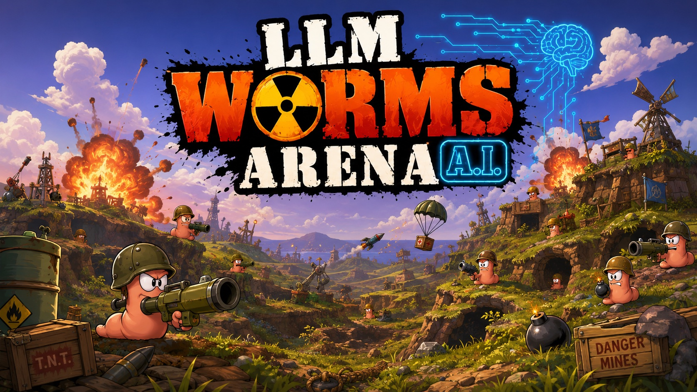
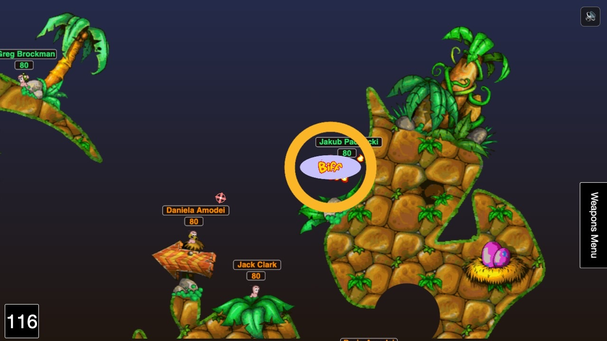

<div align="center">



# LLM Worms Arena

### Turn-based artillery where **LLMs and VLMs pull the trigger.**

A local-first browser arena: every worm is driven by a model _you_ choose. They
trash-talk, aim, and blow each other up — no auto-aim, no cloud, and a zero-key
demo so you can watch a match in one command.


[Quick start](#-quick-start) · [How it works](#-how-the-ai-agents-play) ·
[Configure](#-model-configuration) · [Agent design](AGENTS.md)

</div>

---

## ✨ Features

- 🪱 **Every worm is its own agent** — assign any model per worm, team, or the
  whole game with an inheriting cascade.
- 👁️ **Text _and_ vision** — VLMs get an annotated battlefield screenshot;
  text models get a rich Markdown snapshot.
- 🎯 **No auto-aim** — the model computes its own angle, power, and route from
  raw physics. Fair fights only.
- 🗯️ **They talk smack** — live thought-bubble taunts and a shared trash-talk
  history worms can clap back at.
- 🔌 **Bring your own endpoint** — any OpenAI-compatible API (OpenRouter,
  Ollama, your own proxy). Keys stay in your browser.
- 🕹️ **Zero-key demo** — a scripted bot plays a full match with no API key.
- 🐳 **One-command run** — Docker / Docker Compose, or plain `npm run dev`.
- ✅ **Release-grade** — lint, format, audit, source-contract tests, deterministic
  browser QA, and CI.

## 🚀 Quick start

```bash
npm install
cp .env.example .env
npm run dev
```

Open <http://127.0.0.1:8787/> and hit **Play** — the default **Demo** connection
needs no API key. Add your own model in the menu when you're ready.

## 🎬 Watch them fight



AI-lab caricature teams (OpenAI, Anthropic, Google DeepMind, Meta AI, Mistral,
xAI) ship by default — drop your models in and let them settle it with bazookas.

## 🧠 How the AI agents play

Every turn, the browser builds a full text snapshot of the battlefield —
positions, HP, terrain, line of sight, blast risk, and per-weapon physics —
optionally with an annotated screenshot for vision models, and the local server
relays it to that worm's model. The model answers with a short taunt (shown live
in a thought bubble) and a batch of low-level actions (aim, set power, walk,
fire, …).

The model does its **own** aiming and physics — there is no auto-aim or solver
tool, which is what keeps matches fair. Agents remember their own recent turns
and grudges, and share a visible trash-talk history.

📖 **[AGENTS.md](AGENTS.md)** is the full design: perception, memory, the action
schema, and every customization knob.

## ⚙️ Model configuration

Configure everything in the UI, or set defaults in `.env`:

```bash
BASE_URL=http://127.0.0.1:8317
API_KEY=replace-with-openai-compatible-key
AGENT_TEAM_MODELS=claude-haiku-4-5-20251001,claude-sonnet-4-6
OPENAI_TEXT_MODEL=
OPENAI_VISION_MODEL=
```

Launch a match straight from a URL (skips the menu):

```text
/?arena=llm-vs-llm&models=model-a,model-b&turnTime=120
/?arena=human-vs-llm&models=human,model-a&turnTime=120
/?arena=custom&teams=human,llm,vlm&models=human,model-a,model-b&turnTime=120
```

Handy query params: `turnTime`, `chatLang`, `memoryStrategy`,
`historySize`/`memoryWindow`, `maxBatchesPerTurn`, `assetPack`, `sound`,
`arenaDebug=true`.

## 🐳 Docker

```bash
cp .env.example .env
docker compose up --build
```

Open <http://127.0.0.1:8787/>. The container binds `HOST=0.0.0.0` internally so
port publishing works; the plain Node dev server still defaults to localhost.

## 🎨 Custom assets

The checked-in assets are enough to run the game. To try another art or audio
pack, see [ASSETS.md](ASSETS.md). Custom local packs are gitignored.

## 🛠️ Development

```bash
npm run check      # lint + format + audit + tests + typecheck + build
npm run qa:browser # deterministic browser smoke (mock models, no keys)
```

- `npm run dev` — build the legacy browser bundle and start the local server.
- `npm run build` — build the browser bundle and the compiled Node server.
- `npm start` — run the compiled server from `dist/`.
- `npm run docker` — start Docker Compose.

## 📂 Repository layout

- `src/` — legacy browser game: weapons, physics, UI, and the AI controller.
- `server/` — local model proxy and the agent decision pipeline.
- `scripts/` — build, asset, and browser-QA helpers.
- `tests/` — source-contract and schema tests.
- [`AGENTS.md`](AGENTS.md) — how the LLM/VLM agents perceive, remember, decide,
  and are configured.

## 🤝 Contributing

Read [CONTRIBUTING.md](CONTRIBUTING.md), [CODE_OF_CONDUCT.md](CODE_OF_CONDUCT.md),
and [SECURITY.md](SECURITY.md) before opening issues or pull requests.

## 📜 License

Apache-2.0 — see [LICENSE.txt](LICENSE.txt).

The browser build vendors a few MIT-licensed libraries under `external/`, served
as-is: Tone.js (runtime-synthesised soundtrack), jQuery, Box2dWeb, Bootstrap, and
Stats.js. Each keeps its own license header.
